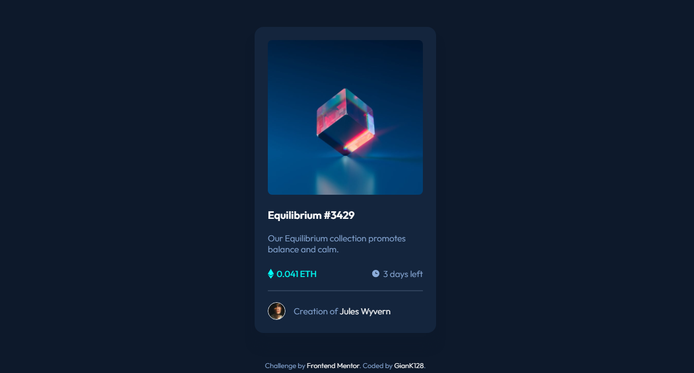

# Frontend Mentor - NFT Preview Card Component (Solution)

This is a solution to the [NFT preview card component challenge on Frontend Mentor](https://www.frontendmentor.io/challenges/nft-preview-card-component-SbdUL_w0U).

## Table of contents

- [Overview](#overview)
  - [The challenge](#the-challenge)
  - [Screenshot](#screenshot)
  - [Links](#links)
- [My process](#my-process)
  - [Built with](#built-with)
  - [What I learned](#what-i-learned)
  - [Continued development](#continued-development)
  - [Useful resources](#useful-resources)
- [Author](#author)

## Overview

### The challenge

Users should be able to:

- View the optimal layout depending on their device's screen size
- See hover states for interactive elements

### Screenshot

### Links

- Solution URL: [Click to go to Github repository](https://github.com/GianK128/GianK128.github.io/tree/master/FEMChallenges/Newbie/NFT-Preview).
- Live Site URL: [Click to go to Github Pages](https://giank128.github.io/FEMChallenges/Newbie/NFT-Preview/).

## My process

### Built with

- Semantic HTML5 markup
- CSS custom properties
  - Positioning
  - Flexbox

### What I learned

I tried to use this challenge to practice on my HTML DOM structure and element hierarchy, trying to reduce the use of `
` elements.
Also, I was trying to solidify my usage of CSS properties and flexbox.

### Continued development

I think I still have to work on element hierarchy and different techniques to display content with CSS.

Also, I have to relearn some properties which I think could've been useful in this challenge, but haven't been used.

### Useful resources

- [Website structure - MDN Web Docs](https://developer.mozilla.org/en-US/docs/Learn/HTML/Introduction_to_HTML/Document_and_website_structure) - This is the page where I started learning structuring and hierarchy from.

## Author

- Frontend Mentor - [@GianK128](https://www.frontendmentor.io/profile/GianK128)
